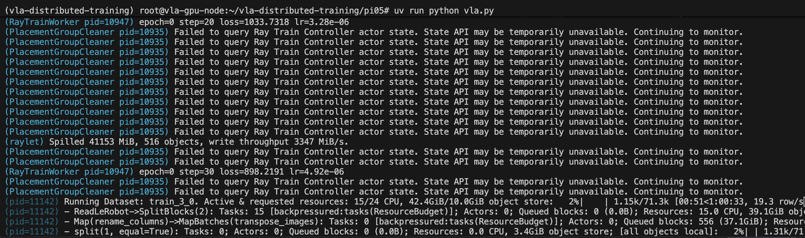
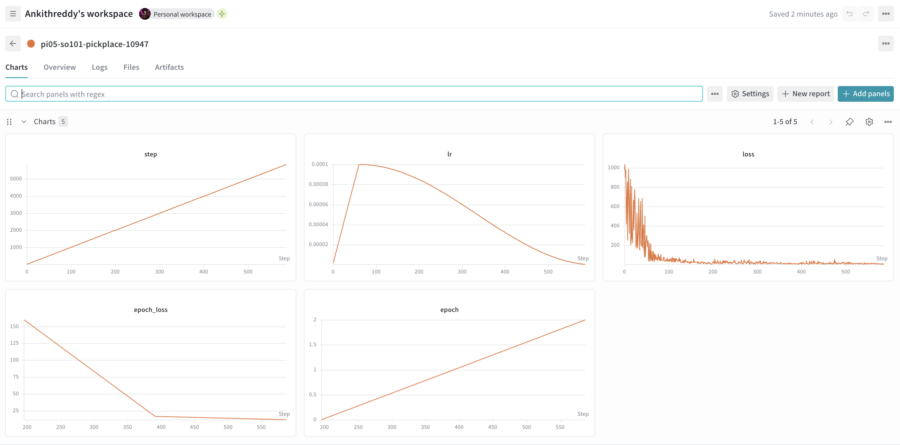

# vla-distributed-training

Distributed fine-tuning of PI0.5 Vision-Language-Action model on custom SO-101 pick-and-place data using Ray Data + Ray Train.


```
S3 (LeRobot v3) ──► Ray Data (CPU pool) ──► Ray Train (GPU)
                     decode mp4               PI0.5 fine-tuning
                     stream batches           W&B + HF checkpoint
```

## Why Ray

Normal training blocks the GPU while the CPU decodes video. Ray Data runs decoding on CPU workers in parallel the GPU never waits for data. 24 CPU cores produced batches faster than the H100's could consume them, triggering backpressure and keeping GPU utilization high.



Each GPU gets a copy of the data batch or a shard of the model, runs the forward pass, computes gradients, then NCCL synchronizes gradients across all GPUs via all-reduce, and the optimizer updates the weights.

 > set batch size and grad accum according to compute you are training on for example:

| | A100 (80 GB) | L4 (24 GB) |
|---|---|---|
| `batch_size` | 4 | 1 |
| `grad_accum` | 2 | 8 |
| `num_workers` | 4 | 4 |

I used 2xH200 sxm with batch size = 16 , gradaccum=1 , num_workers = 2 
> Ray spills to disk and fills the object store quickly if CPUs produce data faster than GPUs can consume it



**Checkpoint:** [ankithreddy/pi05-so101-finetune-v2](https://huggingface.co/ankithreddy/pi05-so101-finetune-v5)
**Dataset:** [ankithreddy/so101_pickplace_tools_v3](https://huggingface.co/datasets/ankithreddy/so101_pickplace_tools_v3)

> PI0.5 uses paligemma as VLM backbone, accept license  [google/paligemma-3b-pt-224](https://huggingface.co/google/paligemma-3b-pt-224) and generate Access token from hugging face

## Setup

```bash
git clone https://github.com/ankithreddy/vla-distributed-training
uv sync
cd pi05
echo "HF_TOKEN=hf_...\nWANDB_API_KEY=..." > .env
uv run python vla.py
```


## Infrastructure

GPU provisioning via Terraform — supports DigitalOcean, RunPod, and Nebius.

```bash
cd infra
export DIGITALOCEAN_TOKEN=dop_...
terraform init 
terraform plan
terraform apply
```

## Inference


Deploy with [lerobot async inference](https://huggingface.co/docs/lerobot/async).

> **Note:** lerobot >= 0.5.2 causes PaliGemma OOM errors. track [#3251](https://github.com/huggingface/lerobot/issues/3251) or replace [paligemma.py](paligemma.py) in lerobot before inferencing 


## In progress
Libero Evaluation and Improving the model

## whats next
Integrating GROOT 1.5 , 1.6 and experimenting with world model /VAM from mimic etc
Integrating more Neocloud gpu compute platforms with terraform support in infra


## Reference
[Anyscale template](https://github.com/anyscale/templates/tree/main/templates/vla-fine-tuning)
[lerobot docs](https://huggingface.co/docs/lerobot/pi05)